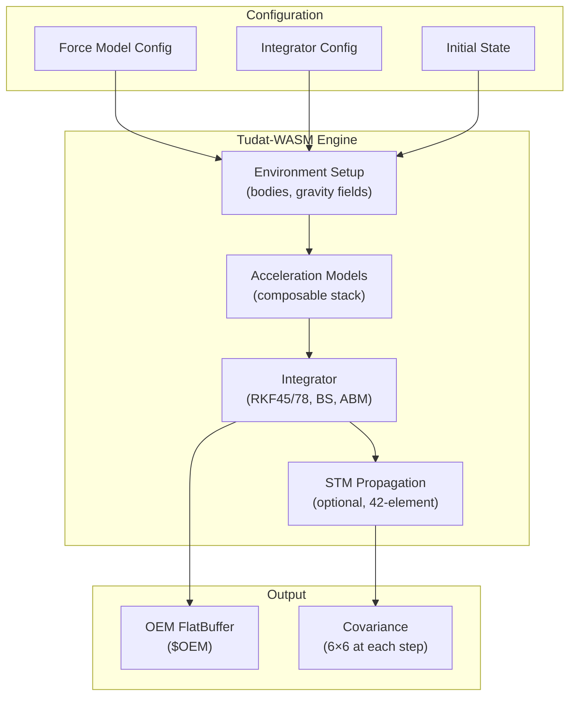

# 🛰️ Numerical Propagator Plugin (Tudat)

[](https://github.com/the-lobsternaut/numerical-propagator-sdn-plugin/actions)
[](LICENSE)
[](https://en.cppreference.com/w/cpp/17)
[](wasm/)
[](https://github.com/the-lobsternaut)

**High-fidelity numerical orbit propagation powered by Tudat-WASM — configurable force models, 7 integrators, covariance/STM propagation, and relativistic corrections.**

---

## Overview

The Numerical Propagator is the full-fidelity propagation backend for the Space Data Network, wrapping TU Delft's [Tudat](https://tudat-space.readthedocs.io/) astrodynamics library compiled to WASM.

### Force Models

| Force | Models | Reference |
|-------|--------|-----------|
| **Gravity** | Point-mass, J2, J4, full spherical harmonics (N×M) | Montenbruck & Gill Ch. 3.2 |
| **Drag** | Exponential, NRLMSISE-00 | Picone et al. (2002) |
| **SRP** | Cannonball (with shadow) | Montenbruck & Gill Ch. 3.4 |
| **Third-body** | Sun, Moon, planets | Vallado Algorithm 29/31 |
| **Relativistic** | Schwarzschild, Lense-Thirring, de Sitter | IERS Conventions (2010) |

### Integrators

| Integrator | Type | Order | Best For |
|-----------|------|-------|----------|
| Euler | Fixed | 1st | Testing only |
| RK4 | Fixed | 4th | Fast propagation |
| **RKF-45** | Adaptive | 4(5) | Standard operational |
| RKF-78 | Adaptive | 7(8) | High-fidelity |
| RKDP-87 | Adaptive | 8(7) | Very high-fidelity |
| Bulirsch-Stoer | Extrapolation | Variable | Smooth trajectories |
| Adams-Bashforth-Moulton | Multi-step | Variable | Long propagations |

---

## Architecture



---

## Research & References

- Dirkx, D. et al. (2019). ["Tudat: a modular and versatile astrodynamics toolbox"](https://doi.org/10.2514/1.G003677). *JGCD*. Tudat library architecture.
- Montenbruck, O. & Gill, E. (2000). *Satellite Orbits*. Springer. Force models and integration.
- Vallado, D. A. (2013). *Fundamentals of Astrodynamics and Applications*, 4th ed.
- IERS Conventions (2010). Relativistic corrections for orbit propagation.
- Holmes, S. A. & Featherstone, W. E. (2002). Stable geopotential recursion.

---

## Build Instructions

```bash
git clone --recursive https://github.com/the-lobsternaut/numerical-propagator-sdn-plugin.git
cd numerical-propagator-sdn-plugin

mkdir -p build && cd build
cmake ../src/cpp -DCMAKE_CXX_STANDARD=17
make -j$(nproc)
ctest --output-on-failure

# WASM build (requires tudat-wasm)
./build.sh
```

---

## Usage Examples

```cpp
#include "numerical_prop/propagator.h"

numerical_prop::ForceModelConfig forces;
forces.gravity = numerical_prop::GravityModel::SPHERICAL_HARMONICS;
forces.gravity_degree = 21;
forces.atmosphere = numerical_prop::AtmosphereModel::NRLMSISE00;
forces.srp = numerical_prop::SRPModel::CANNONBALL;
forces.third_body_sun = true;
forces.third_body_moon = true;

numerical_prop::IntegratorConfig integrator;
integrator.type = numerical_prop::IntegratorType::RKF78;
integrator.abs_tol = 1e-12;

numerical_prop::StateVector initial = {2460000.5, 7000, 0, 0, 0, 7.546, 0};

auto ephemeris = numerical_prop::propagate(initial, 7.0, forces, integrator, 60.0);
```

---

## Plugin Manifest

```json
{
  "schemaVersion": 1,
  "pluginId": "numerical-propagator",
  "pluginType": "propagator",
  "name": "Numerical Propagator Plugin (Tudat)",
  "version": "0.1.0",
  "description": "High-fidelity numerical orbit propagator powered by Tudat-WASM.",
  "license": "BSD-3-Clause",
  "inputs": ["$OEM", "$OCM"],
  "outputs": ["$OEM"]
}
```

---

## License

BSD-3-Clause — see [LICENSE](LICENSE) for details.

---

*Part of the [Space Data Network](https://github.com/the-lobsternaut) plugin ecosystem.*
